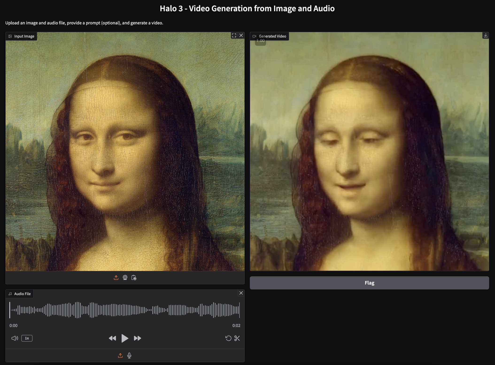

<h1 align='center'>Hallo3: Highly Dynamic and Realistic Portrait Image Animation with Diffusion Transformer Networks</h1>

<div align='center'>
    <a href='https://github.com/cuijh26' target='_blank'>Jiahao Cui</a><sup>1</sup>&emsp;
    <a href='https://github.com/crystallee-ai' target='_blank'>Hui Li</a><sup>1</sup>&emsp;
    <a href='https://github.com/subazinga' target='_blank'>Yun Zhan</a><sup>1</sup>&emsp;
    <a href='https://github.com/NinoNeumann' target='_blank'>Hanlin Shang</a><sup>1</sup>&emsp;
    <a href='https://github.com/Kaihui-Cheng' target='_blank'>Kaihui Cheng</a><sup>1</sup>&emsp;
    <a href='https://github.com/mayuqi7777' target='_blank'>Yuqi Ma</a><sup>1</sup>&emsp;
    <a href='https://github.com/AricGamma' target='_blank'>Shan Mu</a><sup>1</sup>&emsp;
</div>
<div align='center'>
    <a href='https://hangz-nju-cuhk.github.io/' target='_blank'>Hang Zhou</a><sup>2</sup>&emsp;
    <a href='https://jingdongwang2017.github.io/' target='_blank'>Jingdong Wang</a><sup>2</sup>&emsp;
    <a href='https://sites.google.com/site/zhusiyucs/home' target='_blank'>Siyu Zhu</a><sup>1✉️</sup>&emsp;
</div>

<div align='center'>
    <sup>1</sup>Fudan University&emsp; <sup>2</sup>Baidu Inc&emsp;
</div>

<br>
<div align='center'>
    <a href='https://github.com/fudan-generative-vision/hallo3'></a>
    <a href='https://fudan-generative-vision.github.io/hallo3/#/'></a>
    <a href='https://arxiv.org/pdf/2412.00733'></a>
    <a href='https://huggingface.co/fudan-generative-ai/hallo3'></a>
    <a href='assets/wechat.jpeg'></a>
</div>
<br>

<table align='center' border="0" style="width: 100%; text-align: center; margin-top: 80px;">
  <tr>
    <td>
      <video align='center' src="https://github.com/user-attachments/assets/f8161b36-8338-488e-98b2-615e3cbe146e" muted autoplay loop></video>
    </td>
  </tr>
</table>

## 📸 Showcase

<table border="0" style="width: 100%; text-align: left; margin-top: 20px;">
  <tr>
      <td>
          <video src="https://github.com/user-attachments/assets/3fc44086-bdbf-4a54-bfe3-62cfd9dfb191" width="100%" controls autoplay loop></video>
      </td>
      <td>
          <video src="https://github.com/user-attachments/assets/ad5a87cf-b50e-48d6-af35-774e3b1713e7" width="100%" controls autoplay loop></video>
      </td>
       <td>
          <video src="https://github.com/user-attachments/assets/78c7acc3-4fa2-447e-b77d-3462d411c81c" width="100%" controls autoplay loop></video>
     </td>
  </tr>
  <tr>
      <td>
          <video src="https://github.com/user-attachments/assets/f62f2b6d-9846-40be-a976-56cc7d5a8a5b" width="100%" controls autoplay loop></video>
      </td>
       <td>
          <video src="https://github.com/user-attachments/assets/42b6968e-c68a-4473-b773-406ccf5d90b1" width="100%" controls autoplay loop></video>
     </td>
      <td>
          <video src="https://github.com/user-attachments/assets/015f1d6d-31a8-4454-b51a-5431d3c953c2" width="100%" controls autoplay loop></video>
     </td>
  </tr>
</table>

Visit our [project page](https://fudan-generative-vision.github.io/hallo3/#/) to view more cases.

## ⚙️ Installation

- System requirement: Ubuntu 20.04/Ubuntu 22.04, Cuda 12.1
- Tested GPUs: H100

Download the codes:

```bash
  git clone https://github.com/fudan-generative-vision/hallo3
  cd hallo3
```

Create conda environment:

```bash
  conda create -n hallo python=3.10
  conda activate hallo
```

Install packages with `pip`

```bash
  pip install -r requirements.txt
```

Besides, ffmpeg is also needed:

```bash
  apt-get install ffmpeg
```

### 📥 Download Pretrained Models

You can easily get all pretrained models required by inference from our [HuggingFace repo](https://huggingface.co/fudan-generative-ai/hallo3).

Using `huggingface-cli` to download the models:

```shell
cd $ProjectRootDir
pip install huggingface-cli
huggingface-cli download fudan-generative-ai/hallo3 --local-dir ./pretrained_models
```

Or you can download them separately from their source repo:

- [hallo3](https://huggingface.co/fudan-generative-ai/hallo3/tree/main/hallo3): Our checkpoints.
- [Cogvidex](https://github.com/THUDM/CogVideo): Cogvideox-5b-i2v pretrained model, consisting of transformer and 3d vae
- [t5-v1_1-xxl](https://huggingface.co/google/t5-v1_1-xxl): text encoder, you can download from [text_encoder](https://huggingface.co/THUDM/CogVideoX-2b/tree/main/text_encoder) and [tokenizer](https://huggingface.co/THUDM/CogVideoX-2b/tree/main/tokenizer)
- [audio_separator](https://huggingface.co/huangjackson/Kim_Vocal_2): Kim Vocal_2 MDX-Net vocal removal model.
- [wav2vec](https://huggingface.co/facebook/wav2vec2-base-960h): wav audio to vector model from [Facebook](https://huggingface.co/facebook/wav2vec2-base-960h).
- [insightface](https://github.com/deepinsight/insightface/tree/master/python-package#model-zoo): 2D and 3D Face Analysis placed into `pretrained_models/face_analysis/models/`. (_Thanks to deepinsight_)
- [face landmarker](https://storage.googleapis.com/mediapipe-models/face_landmarker/face_landmarker/float16/1/face_landmarker.task): Face detection & mesh model from [mediapipe](https://ai.google.dev/edge/mediapipe/solutions/vision/face_landmarker#models) placed into `pretrained_models/face_analysis/models`.

Finally, these pretrained models should be organized as follows:

```text
./pretrained_models/
|-- audio_separator/
|   |-- download_checks.json
|   |-- mdx_model_data.json
|   |-- vr_model_data.json
|   `-- Kim_Vocal_2.onnx
|-- cogvideox-5b-i2v-sat/
|   |-- transformer/
|       |--1/
|           |-- mp_rank_00_model_states.pt  
|       `--latest
|   `-- vae/
|           |-- 3d-vae.pt
|-- face_analysis/
|   `-- models/
|       |-- face_landmarker_v2_with_blendshapes.task  # face landmarker model from mediapipe
|       |-- 1k3d68.onnx
|       |-- 2d106det.onnx
|       |-- genderage.onnx
|       |-- glintr100.onnx
|       `-- scrfd_10g_bnkps.onnx
|-- hallo3
|   |--1/
|       |-- mp_rank_00_model_states.pt 
|   `--latest
|-- t5-v1_1-xxl/
|   |-- added_tokens.json
|   |-- config.json
|   |-- model-00001-of-00002.safetensors
|   |-- model-00002-of-00002.safetensors
|   |-- model.safetensors.index.json
|   |-- special_tokens_map.json
|   |-- spiece.model
|   |-- tokenizer_config.json
|   
`-- wav2vec/
    `-- wav2vec2-base-960h/
        |-- config.json
        |-- feature_extractor_config.json
        |-- model.safetensors
        |-- preprocessor_config.json
        |-- special_tokens_map.json
        |-- tokenizer_config.json
        `-- vocab.json
```

### 🛠️ Prepare Inference Data

Hallo3 has a few simple requirements for the input data of inference:
1. Reference image must be 1:1 or 3:2 aspect ratio.
2. Driving audio must be in WAV format.
3. Audio must be in English since our training datasets are only in this language.
4. Ensure the vocals of audio are clear; background music is acceptable.

### 🎮 Run Inference

#### Gradio UI 

To run the Gradio UI simply run `hallo3/app.py`:

```bash
python hallo3/app.py
```



#### Batch

Simply to run the `scripts/inference_long_batch.sh`:

```bash
bash scripts/inference_long_batch.sh ./examples/inference/input.txt ./output
```

Animation results will be saved at `./output`. You can find more examples for inference at [examples folder](https://github.com/fudan-generative-vision/hallo3/tree/main/examples).


## Training

#### prepare data for training
Organize your raw videos into the following directory structure:
```text
dataset_name/
|-- videos/
|   |-- 0001.mp4
|   |-- 0002.mp4
|   `-- 0003.mp4
|-- caption/
|   |-- 0001.txt
|   |-- 0002.txt
|   `-- 0003.txt
```
You can use any dataset_name, but ensure the videos directory and caption directory are named as shown above.

Next, process the videos with the following commands:
```bash
bash scripts/data_preprocess.sh {dataset_name} {parallelism} {rank} {output_name}
```

#### Training

Update the data meta path settings in the configuration YAML files, `configs/sft_s1.yaml` and `configs/sft_s2.yaml`:

```yaml
#sft_s1.yaml
train_data: [
    "./data/output_name.json"
]

#sft_s2.yaml
train_data: [
    "./data/output_name.json"
]
```

Start training with the following command:
```bash
# stage1
bash scripts/finetune_multi_gpus_s1.sh

# stage2
bash scripts/finetune_multi_gpus_s2.sh
```

## 📝 Citation

If you find our work useful for your research, please consider citing the paper:

```
@misc{cui2024hallo3,
	title={Hallo3: Highly Dynamic and Realistic Portrait Image Animation with Diffusion Transformer Networks}, 
	author={Jiahao Cui and Hui Li and Yun Zhan and Hanlin Shang and Kaihui Cheng and Yuqi Ma and Shan Mu and Hang Zhou and Jingdong Wang and Siyu Zhu},
	year={2024},
	eprint={2412.00733},
	archivePrefix={arXiv},
	primaryClass={cs.CV}
}
```

## ⚠️ Social Risks and Mitigations

The development of portrait image animation technologies driven by audio inputs poses social risks, such as the ethical implications of creating realistic portraits that could be misused for deepfakes. To mitigate these risks, it is crucial to establish ethical guidelines and responsible use practices. Privacy and consent concerns also arise from using individuals' images and voices. Addressing these involves transparent data usage policies, informed consent, and safeguarding privacy rights. By addressing these risks and implementing mitigations, the research aims to ensure the responsible and ethical development of this technology.

## 🤗 Acknowledgements

This model is a fine-tuned derivative version based on the **CogVideo-5B I2V** model. CogVideo-5B is an open-source text-to-video generation model developed by the CogVideoX team. Its original code and model parameters are governed by the [CogVideo-5B LICENSE](https://huggingface.co/THUDM/CogVideoX-5b/blob/main/LICENSE).

As a derivative work of CogVideo-5B, the use, distribution, and modification of this model must comply with the license terms of CogVideo-5B.

## 👏 Community Contributors

Thank you to all the contributors who have helped to make this project better!

<a href="https://github.com/fudan-generative-vision/hallo2/graphs/contributors">
  
</a>
